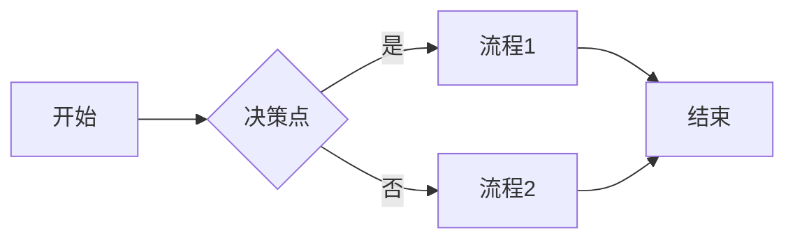

observer/proxy.ts  数据代理

* 1. 缓存机制，缓存代理对象 和 被代理对象
* 2. proxy相较于 Object.defineProperty. Proxy 是不需要递归去代理 每一属性的

如何做依赖收集呢？

确定场景？

```ts
const a = {
  page: 1,
  size: 10,
  searchText: ''
}

function queryTabelData() {
  return new Promise(r => {

  })
}

```

比如我们有 makeReactive

```ts
declare function makeReactive<T>(data: T): T
```

首先数据要做成响应式的。

